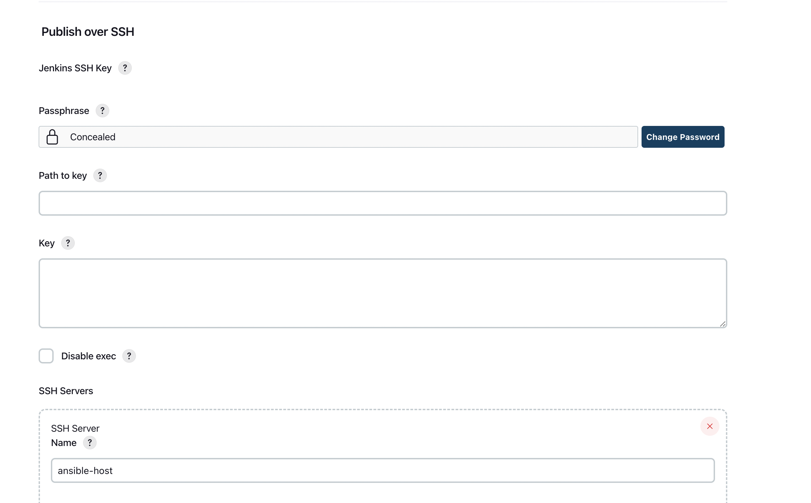
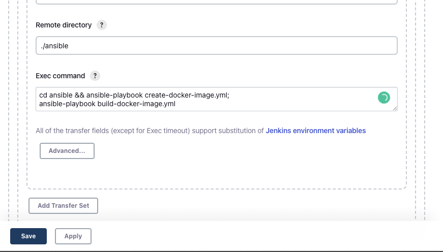

# Start

> [엔서블이란 ?](https://www.redhat.com/ko/technologies/management/ansible/what-is-ansible)

<br />

규모가 작은 인프라 를 관리할때는 terraform 보다는 ansible 이 좀더 편할 것 같아 ansible 로 선택하여 진행 했습니다.


<br />


> [Terraform 과 Ansible 의 차이점](https://rainbound.tistory.com/entry/Ansible-vs-Terraform-vs-Puppet-%EC%B0%A8%EC%9D%B4%EC%A0%90-%EB%B0%8F-%EC%84%A0%ED%83%9D)

<br />

## 실습환경
- ubuntu 18.04 
- naver cloud 

에서 진행 했습니다.

<br />

## 구성 

- Jenkins 서버
- Ansible 서버
- application 을 배포할 서버

다음과 같은 서버를 구성 하실 때 모두 한 서버에 구성 하셔도 상관 없고 각각 다른 서버로 구성하셔도 상관 없습니다.

## Ansible 설치

<br />


```shell
sudo apt update
sudo apt install software-properties-common
sudo add-apt-repository --yes --update ppa:ansible/ansible
sudo apt install ansible
```

ansible 이 정상적으로 설치가 끝나셨다면 hosts 파일에 ansible 의 playbook 을 적용할 서버에 대한 ip 를 작성 합니다.

```
vi /etc/ansible/hosts
```

<br />

```
[devops]
172.0.17.1 ansible_port=20022
```

ansible_port 를 이용하여 port 를 지정 하실 수 있습니다.

정상적으로 서버와 통신 할 수 있는지 ping 체크를 해보겠습니다.

<br />

```shell
ansible devops -m ping
```

<br />


FAIL 이 발생 하신다면 해당 서버의 host 나 port 를 확인 해주시면 됩니다.

<br />


## Jenkins 에 Ansible ssh server 등록

<br />

jenkins plugin publish over ssh 를 설치 하신뒤 ansible 서버를 추가합니다.

<br />
<br />



<br />
<br />

[Jenkins 로 Spring boot 배포하기](https://jongyunha.github.io/jenkins/2022-12-17/)
를 참고하여 마지막 Exec command 부분 만 변경 해보겠습니다.

그전에 먼저 ansible playbook yml 파일 을 작성 하겠습니다.

<br />
<br />

## Ansible playbook

먼저 docker file 을 build 하여 public repository 에 push 한뒤 image 를 pull 받아서 docker run 을 하는 방식으로 구성 하겠습니다.

<br />
<br />

create-docker-image.yml
```yaml
- hosts: devops
  tasks:
    - name: Build a docker image with deployed jar file
      command: docker build -t spring-app .
      args:
        chdir: /root
    
    - name: Docker login
      command: docker login -u "{{ DOCKER_ID }}" -p "{{ DOCKER_PASSWORD }}"

    - name: Push the image on Docker hub
      command: docker push docker_id/spring-app:latest
```

<br />
<br />

build-docker-image.yml
```yaml
- hosts: devops
  tasks:
    - name: stop current running container
      command: docker stop spring-app
      ignore_errors: yes
    
    - name: remove stopped container
      command: docker rm spring-app
      ignore_errors: yes

    - name: pull the newest docker image from docker hub 
      command: docker pull docker-id/spring-app:latest

    - name: Create container using spring-app image
      command: docker run -d --name spring-app -p 8080:8080 docker-id/spring-app:latest
```

<br />
<br />

해당 두 파일을 다음과 같은 경로에 만들어 주겠습니다.
```shell
mkdir ~/ansible
touch ~/ansible/create-docker-image.yml
touch ~/ansible/build-docker-image.yml
```

## Jenkins Exec command 설정

<br />
<br />

```shell
cd ansible && ansible-playbook create-docker-image.yml;
ansible-playbook build-docker-image.yml
```

<br />
<br />



다음과 같이 설정한후 Save > Build now 를 해주시면 성공적으로 Ansible 을 통해 build 가 된것을 확인해 보실 수 있습니다.