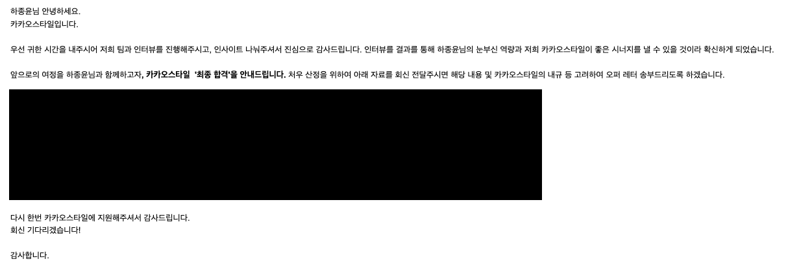

## part.1

 
 

2022년 에는 다사다난한 일들이 많았다 그리고 직장도 안정적이지 않아 한편으로는 마음이 안정적이지 않았지만 그걸 동기부여 삼아 열심히 했던것 같다.
개발을 시작한지 3년이 되는 시기이기도 했고 많이 안다고 생각하면서도 모르는게 정말 많다고 느꼈다.

항상 스타트업에서 개발을 했고 한번쯤은 대기업에 가보고 싶다는 생각도 있었고 여러군데 이력서를 넣어보던중 면접이 너무좋았던 카카오 스타일로 합류하게 되었다.

 

 

이 글을 쓰는날 입사한지 6개월이 되는 시기이기도 하다.

 

입사 후엔 kotlin, spring, graphql 이라는 기술에 대해 지식이 별로 없어 주로 이 3가지를 공부하는데 많은 시간을 보냈던거 같다.
spring 은 나름 안다고 생각했는데 코드리뷰 와 이슈를 해결 하면서 내가 정말 spring 에 대해 모르는게 너무 많구나 라는걸 느끼기도 했다.

그리고 webFlux 프로젝트를 할기회가 있었는데 java, kotlin 에서의 비동기 handling 에 대해서도 많이 배웠다 (삽질 엄청 하면서..)

요즘엔 주로 Redis 와 spring batch 에 대해 공부중인데 이두가지가 끝나면 Kafka 에 대해서 공부할 예정이다.

 

2021년 까지만 해도 알고리즘 문제에 대해 그렇게 흥미가 없었는데 이직준비를 하면서 알고리즘 때문에 떨어지는 경우가 너무 많아 따로 시간을 내 준비하다 보니 나름 흥미가 생겨 요즘 도 가끔 문제를 풀고 있다. leetcode medium 까진 무난하게 푸는 듯하고 hard 는 아직 (많이?!) 어렵다..

CS 관련 공부도 많이 했고 책도 읽으면서 컴퓨터가 어떻게 돌아가는지에 대한 지식도 많이 늘었다.

코딩관련해서는 개인적인 목표로는 이번해에는 네트워크 와 인프라 관련 공부를 해보려고 한다.

 

연말에 기존에 살던집이 계약이 종료되면서 이사를 하게 되었다. 연말 연초로 생각보다 많은 약속과 술자리 그리과 최근.. 과식으로 인해 내 라이프 사이클이 조금 망가진 기분이다.
그리고 많이 좋아졌다고 생각한 나의 산만함이 다시 주체를 못하는 기분도 든다. 어쩔때는 책상앞에 앉아서 30분을 집중하기 힘들다고 느껴질때도 있다.

그래서 다시 한번 내인생을 reset 해보려고 인생 디톡스를 해보려고 한다.

 

> 12 Moth life detox challenge

- Month 1 - 아침 7시 기상하기
- Month 2 - 매일 1시간 헬스하기
- Month 3 - 매일 1시간 영어공부하기
- Month 4 - 매일 1시간 나만의 프로젝트 하기
- Month 5 - 술 / 야식 끊기
- Month 6 - 밀가루 / 설탕 끊기
- Month 7 - 매일 30 분 독서하기
- Month 8 - SNS 및 youtube 끊기
- Month 9 - 매일 30 분 명상 및 스트레칭 하기
- Month 10 - 모든 구독 해지하기
- Month 11 - 영어 모임에 나가보기
- Month 12 - 1 ~ 11 중 3개이상 적용하기

2023 년 회고에서는 나의 계획이 잘지켜져 나에게 작은 선물을 줄 수 있도록 노력해야겠다.

 

어느덧 29살이 되었다 아직 사회적으로는 많은 나이가 아니지만 곧 30 이라는 생각에 돈도 아끼면서 살아야 할거 같고 미래의 목표를 재정비 하면 좋을거 같다는 생각이 들었다.
개발 일을 시작하면서 부터 목표는 단 하나였는데 해외에서 일해보고 싶다는 생각이 줄곧 있었다.

영어권 나라에서 일을 하고 싶었고 미국은 비자 경쟁이 치열해서 캐나다를 선택했다. 한번에 바로 취업하여 워킹비자로 일을 시작하면 좋겠지만 나는 영어를 잘 하지 못해
워홀 비자로 시작하여 6개월 영어 공부 하고 나머지 기간에 job 을 구해보려고 한다.

나이제한으로 인해 내년이 마지노선이고 자금도 내년쯤이면 다 모을거 같아 내년에 지원해볼 생각이다. 꼭 직장을 못구하더라도 지금아니면 못해볼거 같아 후회는 안할것 같다
또 그만큼 열심히 영어 공부도 해야겠지만

이번에 출국을 앞두고 Amazon 에서 해고 통보를 받았다는 글을 읽고 경제도 많이 어렵기도 하고 이렇게 쉽게 해고통보를 받는구나 라는 생각도 들어 준비를 더 잘해야겠다는 생각도 들었다.

 

> 올 한해는 나에게는 너무 복에 겨운 한해였다 좋은 직장, 좋은 사람, 사랑하는 사람까지 지금 내가 누릴수 있는 것들을 잃지 않도록 더 열심히 해야겠다.
