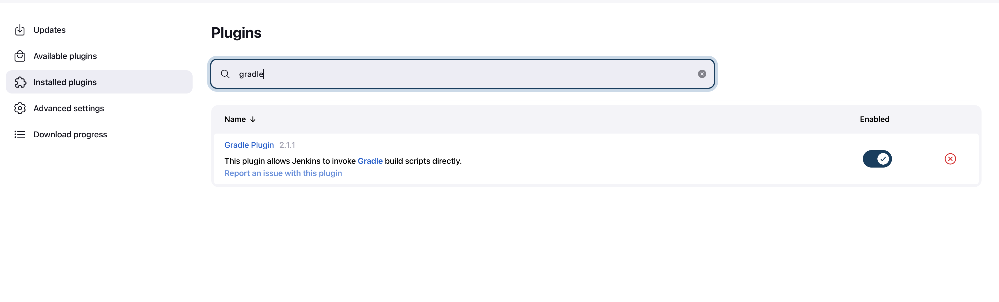
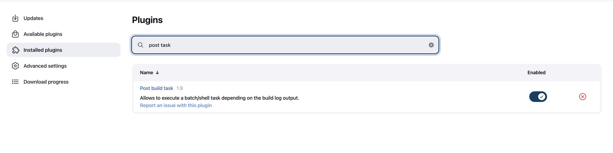
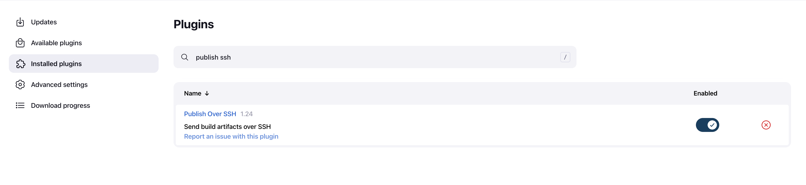
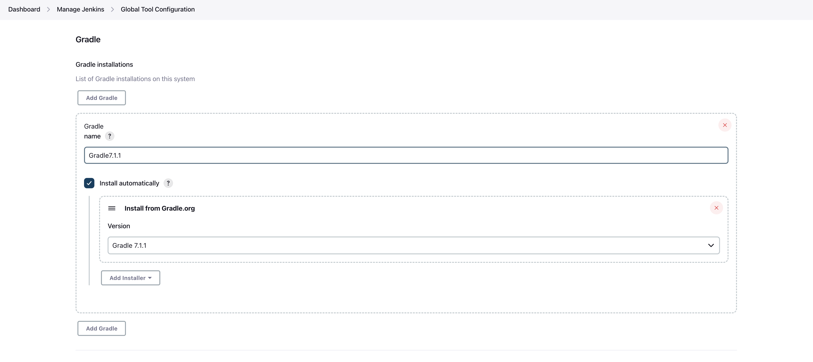
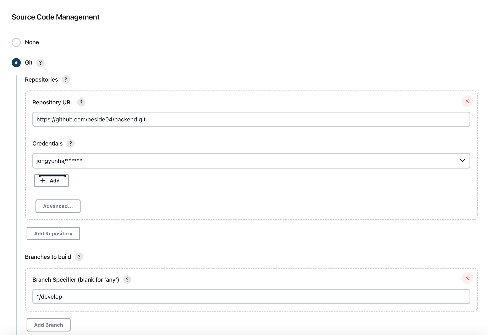
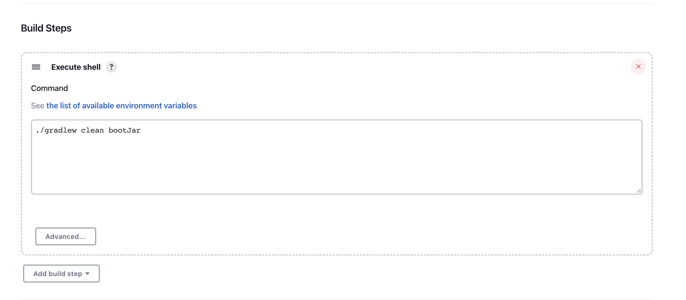
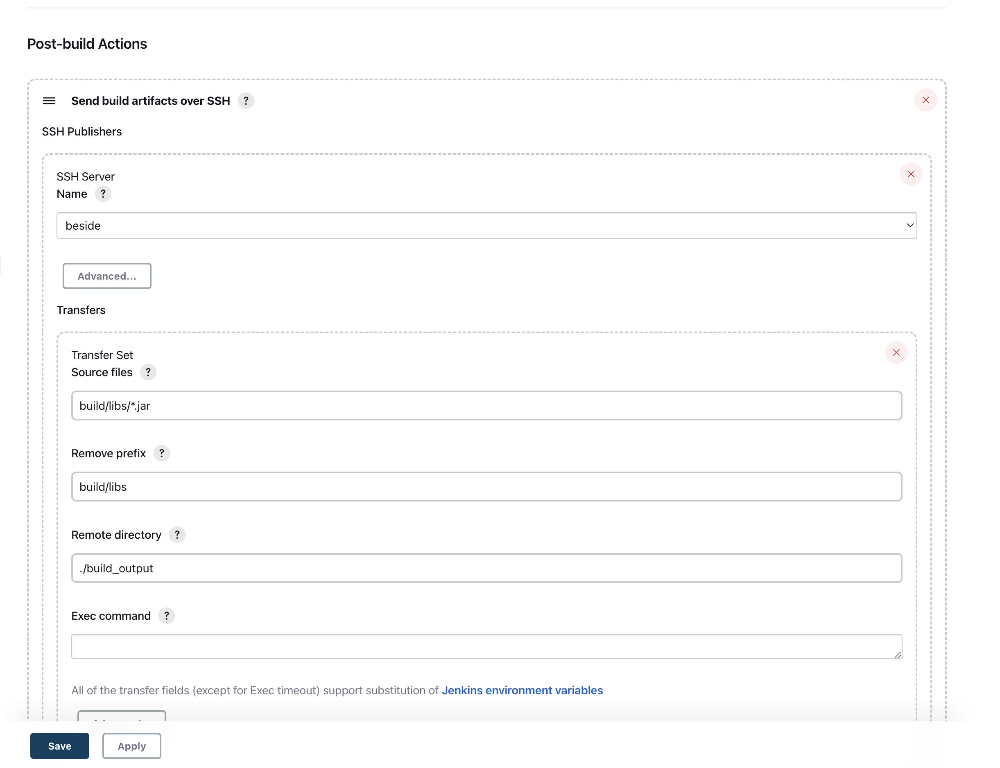
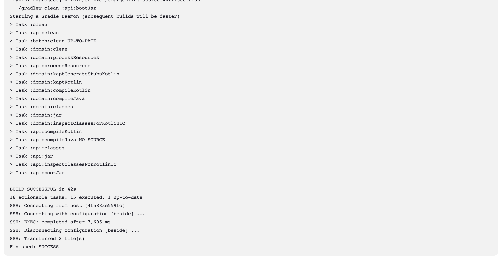

# Start
> Jenkins 가 설치되어있다는 가정하에 시작합니다.
[Jenkins 설치하기](https://hudi.blog/install-jenkins-with-docker-on-ec2/)

## Plugin 설치하기
설치해야 할 플러그인 목록들

- gradle plugins (jar 파일을 만들기 위함)
- post build task (build 가 성공 후 action task 를 지정)
- publish over ssh (ssh 서버 접속 및 명령어)



<br/>



<br/>



<br/>

plugin 이 모두 설치 되었으면 gradle 설치를 합니다.

<br />




gradle 설치가 끝났으면 

Dashboard > Manage Jenkins > Configure System
에서 publish over ssh 의 ssh 서버를 추가합니다.

<br />


## Item
New item > Free style project 를 생성합니다.

Git repository 를 추가하고 credentias 와 배포할 branch 를 설정합니다.

<br />



build script 를 작성합니다.

<br />



ssh 서버를 통해 해당 *.jar 파일을 copy 합니다.

<br />




마지막으로 해당 File 이 Copy 가 완료되면 ssh 의 서버에 docker 명령어를 통해 docker image 로 build 후 실행 합니다.

Exec command 안에 다음과 같이 작성합니다.


<br />

```shell
cd build_output && docker build --tag=spring-app -f Dockerfile .;
docker run -d -p 8080:8080 --name spring-app spring-app:latest
```

Dockerfile

```docker
FROM adoptopenjdk/openjdk11
MAINTAINER JongyunHa

ENV TZ "Asia/Seoul"

COPY api.jar api.jar

EXPOSE 8080

ENTRYPOINT ["java", "-jar", "-Dspring.profiles.active=dev", "/api.jar"]
```

Build now 를 하시게 되면 

<br />



다음과 같이 결과를 console output 에서 보실수 있습니다.